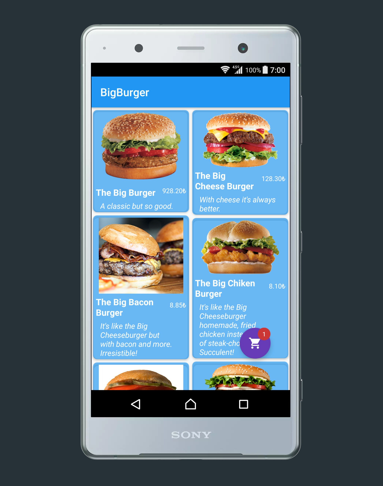

<h2>  
   BigBurger</h2>
  
 
 
 
Big Burger, a new Burger player arrives in Bursa, This is a  first version of the mobile application to
view the catalog and compose a shopping cart.

## Features
<ul>
 <li> This app is written with the standards of high-quality code.</li>
 <li> Uses Androidx libraries.</li>
 <li> App is awar of Android lifecycle.</li>
 <li> Uses Retrofit2 and RxJava.</li>
 <li> MVP architecture .</li>
 <li> Handeling most of the errors that may haapen. </li>
 <li> Third-party Libraries like (Picasso , couterFab, spotlight,SwipeHandler)</li>
 <li> You can swipe Left or right to add or delete items</li>
 </ul>

### Screenshots 

    

   

